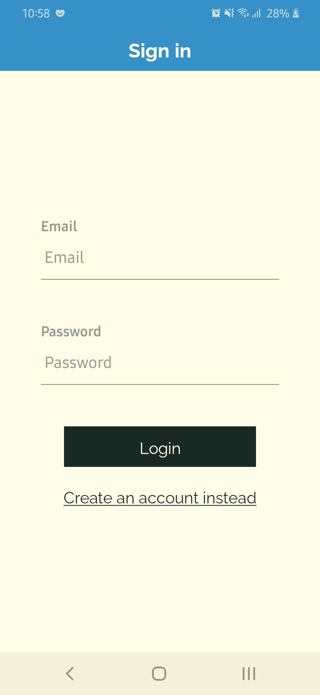
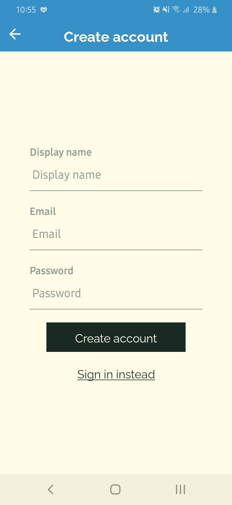
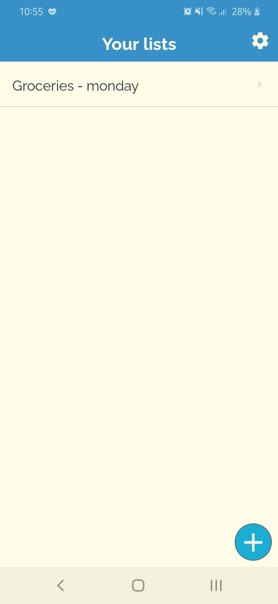
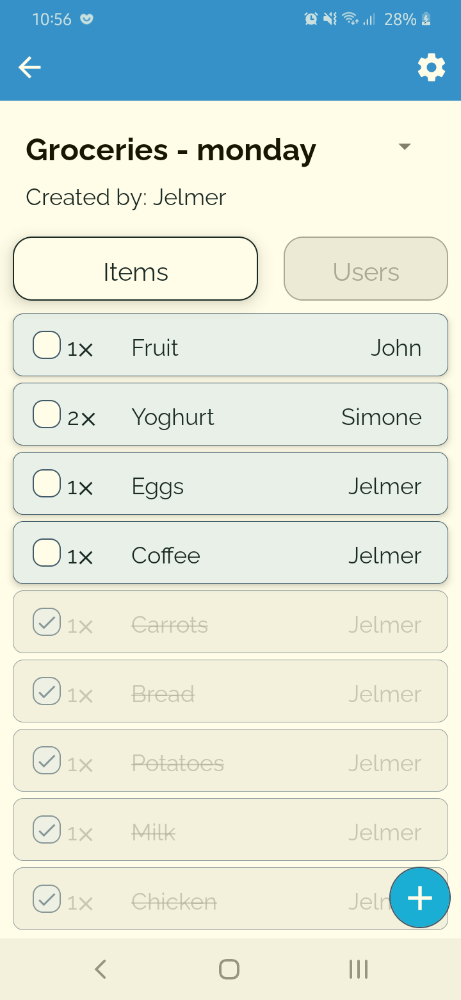
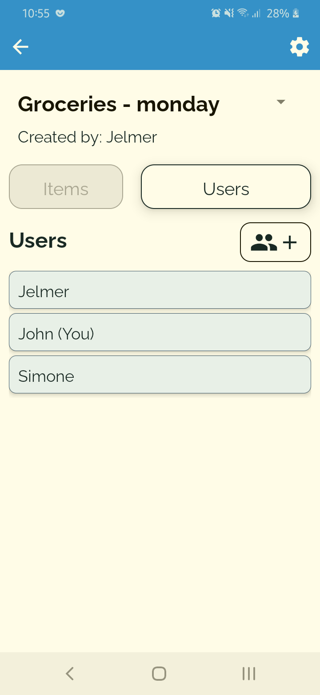
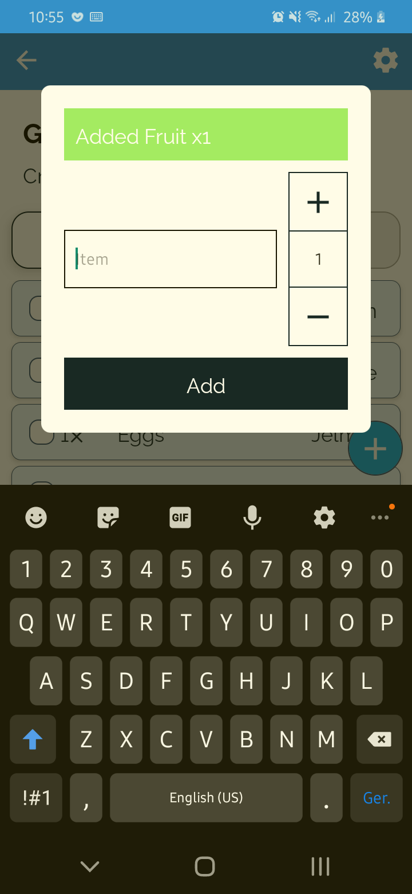

# Grocery Lists

      
    

An application built in React Native to keep your grocery lists (or any list for that matter) and share them with other people!

Note: The application is developed on an Android and might not work optimally on an iOS device.

## Why did I build this
I built this app to dive into firebase authentication and firestore. During this project I learnt how to implement firebase into react-native, how to setup an email authentication flow with firebase and how to use firestore.
This was my first time working with a document-oriented database, so while learning about all the firestore functions in React Native I also picked up a lot about how these databases work.
There is also a language switcher with appropriate translations in the application, implemented with i18next and react-i18next

## What would I do differently?
In future projects that involve firestore I will probably use a wrapper library such as react-firebase-hooks to simplify the usage of firestore data. I would also add a 'last_updated' timestamp to all data, so queries will only fetch documents that have actually changed. Because firestore is based around paying for every document you read/write/delete it would be very important in any project to minimize the amount of unnecessary documents being touched.

### How to run
#### Locally
1. Clone the repository
2. Run `npm ci` in the root of the project
3. Run `npm run start` to start a packager
4. Run `npm run android` to run the application on a connected device or emulator
